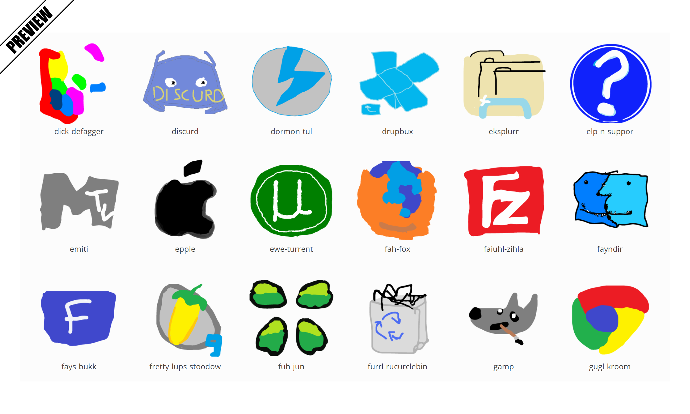

# Misspelled Desktop Icons

The earliest known image compilation of hand-drawn icons can be found in a 4chan thread dating back to November 30th, 2007. The OP began the thread with a rather poorly drawn Google site logo and the misspelled caption Gouleg. Status, confirmed, year 2008, origin 4chan, tags 4chan, wurds, ms, paint, ms paint, misspelled, desktop, icons, about, mS Paint Desktop Icons (also known as Misspelled Desktop Icons) refers to a series of hand-drawn computer icons with intentional spelling errors created by using basic image editors like MS Paint. The thread came to be also known by alternative names like Draw Desktop Icon in 30 seconds. The practical usage of such icons outside of 4chan threads remains little documented, but their aesthetics and nostalgic value seem to be the main appeals. 

See [http://knowyourmeme.com/memes/ms-paint-desktop-icons](http://knowyourmeme.com/memes/ms-paint-desktop-icons)

## [realjck.github.io/misspelleddesktopicons/](https://realjck.github.io/misspelleddesktopicons/)

## Proposed file formats

**ico:** ICO files / sizes embeded: 256x256px, 128x128px, 48x48px, 32x32px, 16x16px / 32-bit color (with alpha channel)

**png:** image/PNG files / 256x256px / 32-bit color (with alpha channel)

**svg:** Scalable Vector Graphics files / version 1.1

## Available icons (87)

* abg
* achoons
* adrubie-ilustrter
* adub-flush
* ai-see-qu
* ardurb-radar
* ayoel
* bizoualuideo
* boonoountoo
* bremur
* calxluater
* camrend-pormt
* dato2
* deabro-free
* dick-defagger
* discurd
* dormon-tul
* drupbux
* eksplurr
* elp-n-suppor
* emiti
* envida
* epple
* ewe-turrent
* fah-fox
* faiuhl-zihla
* fayndir
* fays-bukk
* fretty-lups-stoodow
* fuh-jun
* furrl-rucurclebin
* gamp
* gouleg-sarch-engene
* gugl-kroom
* gurgl-erf
* hafl-live-teu
* hylyff
* intrnt-explurr
* leg-ef-lehhins
* logic-tek
* lcusatrats
* lunyx
* mdyr-plyr-caslik
* mecr-sref
* micwosof-wurd
* mikrozsof-flig-simhulatr
* moncroft
* munswapper
* muvie-raker
* natnial-gegrapic
* ndroyt
* nehdpd-bluz
* nytepod
* ophrah
* opn-ofice
* pedef
* pent
* poty
* purtol-too
* queerk-threa
* seeclearner
* skiep
* skrim
* spotefhy
* stam
* sven-zap
* taem-furtres
* tarr-bouzer
* terrerrya
* toktok
* tursk-munerger
* twerder
* urdacirtieh
* uurmty-rucyclebin
* velc
* vodosjob
* vooz
* wandoos-midiu-pliju
* wekepeediuh
* wenmop
* windoughs-liev-mesungur
* winryr
* winzeerp
* worl-warkraff
* x-boc
* yahew-masngaers
* yuotub

### This webpage uses:

* jQuery
* [bootstrap 3](https://github.com/twbs/bootstrap)
* [Simplex theme by bootswatch](http://bootswatch.com/)
